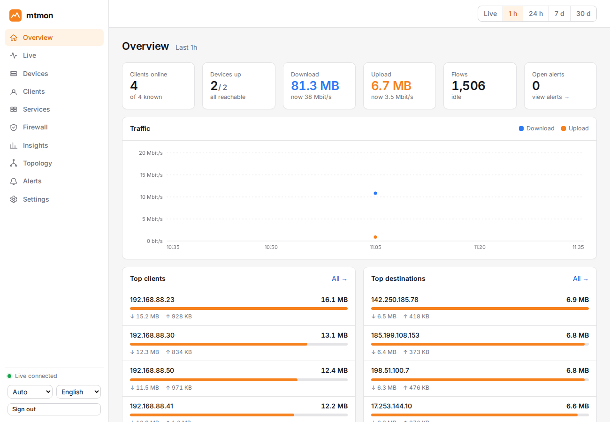
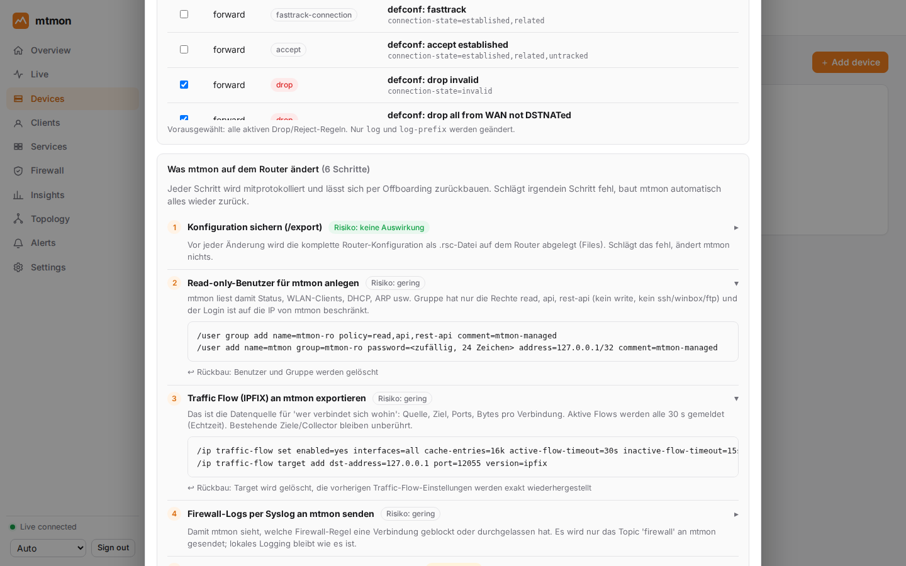
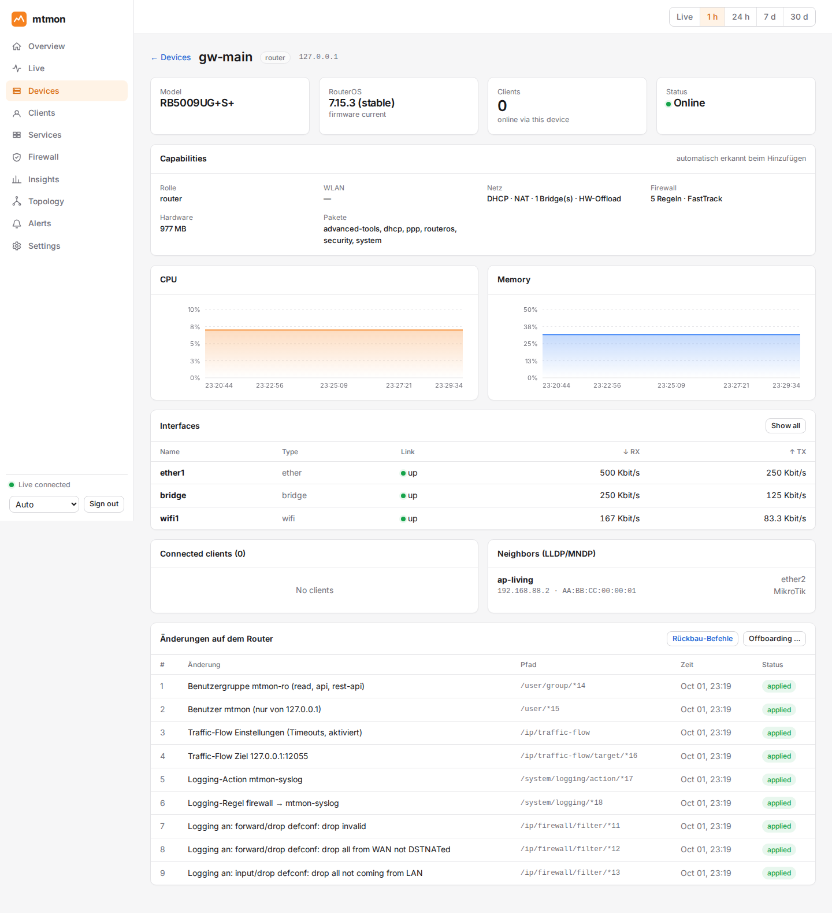
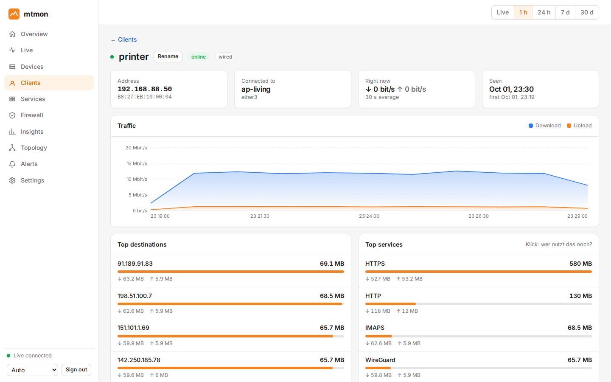
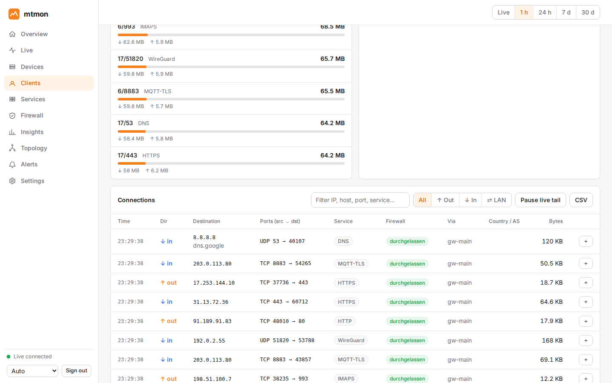
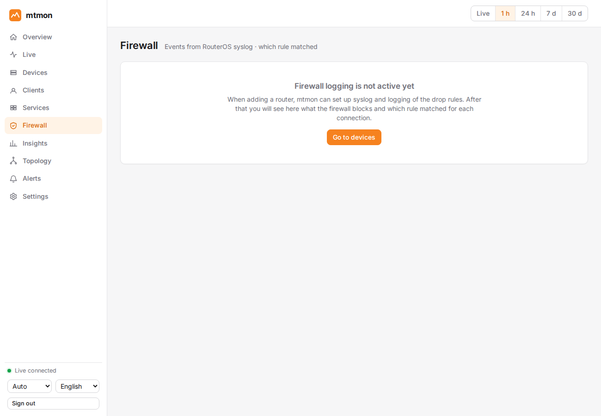
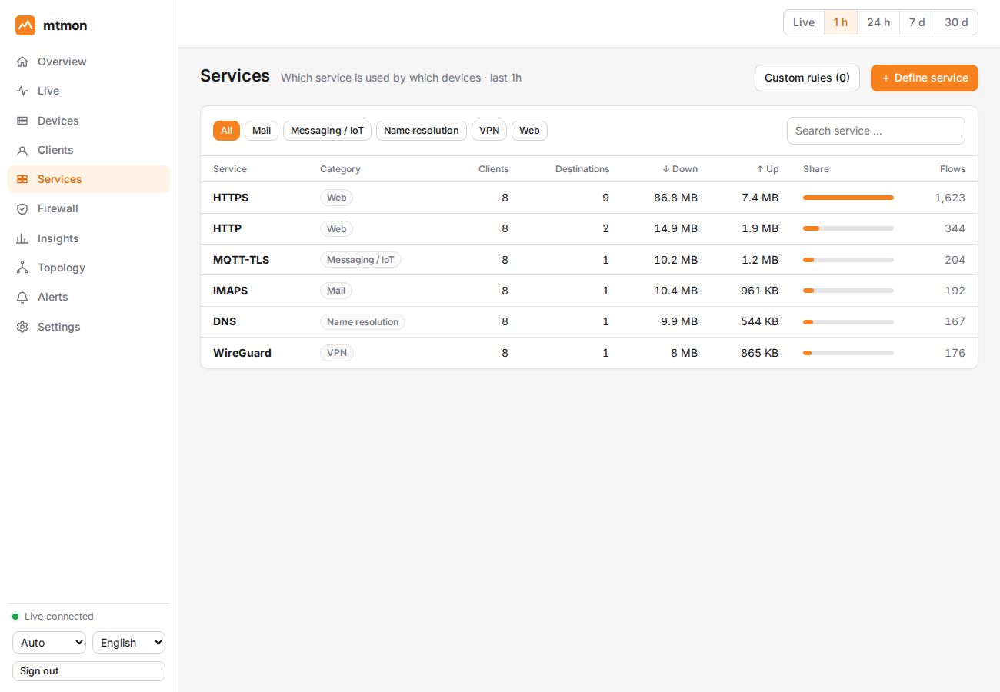
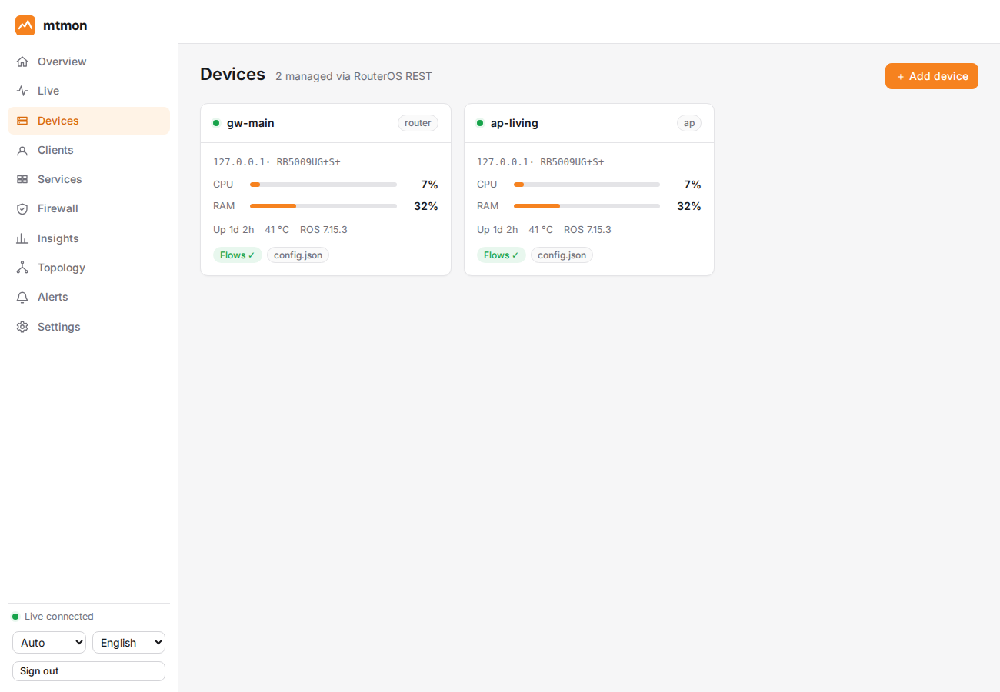
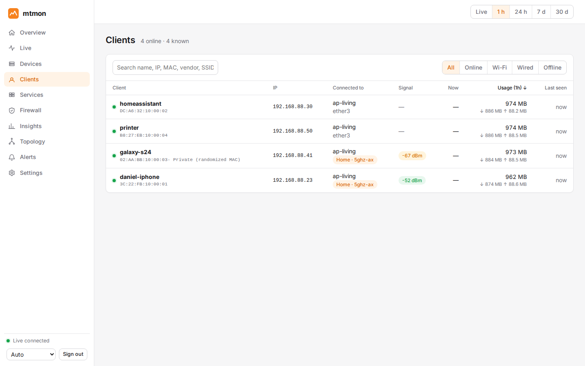

<h1 align="center">mtmon</h1>
<p align="center"><b>Realtime monitoring for MikroTik routers and access points.</b><br>
See who talks to whom, how much, over which port, and whether your firewall let it through.<br>
One small container, zero-touch device onboarding, fully reversible.</p>

<p align="center">
  <a href="https://github.com/napfkuchen1/mtmon/actions/workflows/ci.yml"></a>
  <a href="https://github.com/napfkuchen1/mtmon/releases/latest"></a>
</p>

<p align="center"></p>

---

## Table of contents

[What it does](#what-it-does) · [Why mtmon](#why-mtmon) · [Screenshots](#screenshots) · [Requirements](#requirements) · [Install](#install) · [Usage](#usage) · [What mtmon changes on your router](#what-mtmon-changes-on-your-router) · [Update](#update) · [Uninstall](#uninstall) · [Security & privacy](#security--privacy) · [Known limits](#known-limits) · [Troubleshooting](#troubleshooting) · [Development](#development)

## What it does

mtmon answers the questions you normally need three tools for:

* **"What is that device doing on the internet?"** Pick a client (a printer, a camera, a phone) and see every destination it contacted: IP, domain, country and provider, source and destination port, bytes up/down, and the router it went through.
* **"Did my firewall allow that?"** Every connection carries a verdict: *blocked* (with the rule that dropped it), *allowed*, or *logged*. Blocked attempts never show up in flow data, so mtmon also reads your router's firewall log.
* **"Who else uses this service?"** Classify traffic by port, IP, network, domain or AS number ("this is NTP"). Click the service and see every client and destination behind it, over any time range, including the history you collected before you created the rule.
* **"Is my gear healthy?"** CPU, memory, temperature, interface state, Wi-Fi clients with signal and SSID, DHCP leases, roaming events, topology, and alerts (device offline, interface down, new client, traffic spike, port-scan patterns).

Adding a router is a form in the web UI: enter its address and a one-time admin login, review what mtmon is about to configure, confirm. No config files, no copy-pasting RouterOS snippets.

## Why mtmon

| | mtmon | Typical alternatives |
|---|---|---|
| **Onboarding** | A wizard reads the router's capabilities and sets up a read-only user, Traffic Flow and firewall logging for you. Every change is listed, backed up, and undoable with one button. | Hand-written RouterOS commands, SNMP profiles, exporter configs. |
| **Per-client view** | Each client has its own timeline of connections with ports, services, firewall verdict and routing path. | Dashboards of interface counters and top talkers by IP; mapping IPs to devices is manual. |
| **Firewall verdict** | Combines flow data with the router's firewall log, so you see *blocked* attempts and the rule that fired. | Flow tools only see traffic that was forwarded. |
| **Service classification** | Your own rules (port/IP/CIDR/domain/ASN) with live impact preview, applied retroactively to stored data. | Fixed port lists. |
| **Footprint** | One static ~19 MB binary with SQLite: ~16 MB RAM idle, ~45 MB at 5,000 flows/s. Runs in a 1 GB unprivileged LXC. | Multi-container stacks (collector + database + dashboards) or heavyweight flow analyzers. |
| **Your data stays yours** | Self-hosted, no account, no cloud, no telemetry. | Often SaaS, or a separate database to run and secure. |
| **Reversible** | Offboarding restores the router to its previous state and offers a manual script if the router is unreachable. | Usually manual cleanup. |

mtmon is not a replacement for a full network management system that polls arbitrary vendors via SNMP. It is built for MikroTik RouterOS 7 and goes deep on that one thing.

## Screenshots

> Demo data from the built-in simulator (mock routers and synthetic traffic).

<table>
  <tr>
    <td width="50%"><br><sub><b>Add a device.</b> The plan lists every change with a reason, the exact commands, the undo step and the risk.</sub></td>
    <td width="50%"><br><sub><b>Device page.</b> Capabilities read from the router, health metrics, and the list of changes mtmon made, with offboarding.</sub></td>
  </tr>
  <tr>
    <td><br><sub><b>Client detail.</b> Traffic over time, top destinations, services, ports and countries for one device.</sub></td>
    <td><br><sub><b>Connections.</b> Every connection with source → destination port, service, firewall verdict and router.</sub></td>
  </tr>
  <tr>
    <td><br><sub><b>Firewall.</b> Blocked and allowed over time, rules by hits, top blocked sources and destinations, event stream.</sub></td>
    <td><br><sub><b>Services.</b> Everything grouped by service; click one to see all clients and destinations that use it.</sub></td>
  </tr>
  <tr>
    <td><br><sub><b>Devices.</b> Status, Wi-Fi, flow and firewall-log state at a glance.</sub></td>
    <td><br><sub><b>Clients.</b> Everything on your network, with vendor, address and live rates.</sub></td>
  </tr>
</table>

## Requirements

**Proxmox host**

* Proxmox VE 9.x and a root shell (SSH or the node's console)
* A storage for container disks and a Linux bridge that can reach your MikroTik devices
* Internet access on the node for the one-line installer (it downloads the release from GitHub, and the Debian template if missing)
* `whiptail` for the dialog (part of every Proxmox VE installation)

**Container** (created for you): unprivileged Debian 13 LXC. 2 vCPU, 1 GB RAM and 8 GB disk are plenty for ~100 clients. A fixed IP or DHCP reservation is recommended, because your routers send data to it.

**MikroTik devices**

* RouterOS 7 with the REST API; `www-ssl` (HTTPS) must be enabled on the device
* For Wi-Fi details: the current `wifi` package (the legacy `wireless` package is only partly supported)
* A one-time admin login so mtmon can set itself up (not stored), or an existing read-only user if you prefer to configure the router yourself

**Network paths**

| From → To | Port | Purpose |
|---|---|---|
| Your browser → container | TCP 8443 | Web UI (HTTPS, self-signed) |
| Router → container | UDP 2055 | Traffic Flow (IPFIX) |
| Router → container | UDP 5514 | Firewall log (syslog) |
| Container → router | TCP 443 | RouterOS REST API (read-only polling) |

Optional: internet access from the container for GeoIP/ASN data (DB-IP Lite) and the vendor list (IEEE OUI).

## Install

Run this **on the Proxmox host** as root:

```bash
bash -c "$(curl -fsSL https://raw.githubusercontent.com/napfkuchen1/mtmon/main/install.sh)"
```

A small dialog opens and asks for everything it needs, with sensible defaults:

1. **Action**: install, update or uninstall
2. **Container ID**: the next free ID is suggested
3. **Hostname**, **storage** and **bridge**, picked from what your node actually has
4. **VLAN** (optional) and **IP address** (DHCP or static, with gateway and DNS)
5. **Resources**: recommended defaults or your own values
6. **GeoIP / vendor data**: yes or no
7. **Summary**: install now, or *preview only* (shows every step and changes nothing)

When it finishes it prints the URL, the user `admin` and a generated password. The credentials are also saved to `/root/mtmon-<CTID>-credentials.txt` on the host (mode 0600); delete that file once you have stored the password safely.

The installer downloads the latest release, **verifies its SHA-256 checksum**, creates an unprivileged LXC and installs a hardened systemd service. It only touches the container it creates.

<details>
<summary>Non-interactive install, pinned versions, manual download</summary>

```bash
# preview only: prints every step, changes nothing
bash -c "$(curl -fsSL https://raw.githubusercontent.com/napfkuchen1/mtmon/main/install.sh)" -- install --dry-run

# fully scripted
bash -c "$(curl -fsSL https://raw.githubusercontent.com/napfkuchen1/mtmon/main/install.sh)" -- \
  install --ctid 210 --storage local-lvm --bridge vmbr0 --ip 192.168.88.50/24 --gw 192.168.88.1 --with-geo --yes

# pin a version
MTMON_VERSION=v0.7.0 bash -c "$(curl -fsSL https://raw.githubusercontent.com/napfkuchen1/mtmon/main/install.sh)"
```

All options: `install.sh install --help`. You can also download `mtmon-linux-amd64.tar.gz` and its `.sha256` from the [releases page](https://github.com/napfkuchen1/mtmon/releases), unpack it on the host and run `./install-mtmon.sh --dry-run`.
</details>

## Usage

1. **Open the UI** at `https://<container-ip>:8443` and sign in as `admin`. Your browser will warn about the self-signed certificate; that is expected.
2. **Add your first device**: *Devices → Add device*.
   * Enter the router's address and port (443) and a one-time admin login.
   * mtmon connects, shows the certificate fingerprint (confirm that it matches your router) and reads the model, packages, Wi-Fi stack, bridges, DHCP/NAT, FastTrack, firewall rules and the current Traffic Flow state.
   * You get a plan: for each step what is changed, why, the exact commands, the undo and the risk. Choose *Auto-setup*, or *Monitor only* (read-only; you configure the router yourself).
   * Confirm. mtmon makes a backup (`/export`), creates a read-only user, enables Traffic Flow and firewall logging, verifies that it can log in with the new user, and **forgets the admin login**.
3. **Look around** (data appears within seconds):
   * **Overview**: traffic, top clients, top destinations, devices up, open alerts
   * **Live**: realtime feed of connections as they happen
   * **Clients**: click one for its timeline, destinations, ports, countries, blocked attempts and IP/roaming history
   * **Firewall**: what was blocked or allowed, and by which rule
   * **Services**: traffic grouped by service; define your own with the **＋** button next to any connection, destination or port
   * **Insights**, **Topology**, **Alerts**, **Settings** (alert targets such as webhook, ntfy or e-mail; data retention)
4. **Classify a service.** For example, click ＋ on an NTP connection, name it "NTP" and choose *port 123*. A live preview shows how much stored traffic it affects. Afterwards *Services → NTP* lists every client and server that uses it, also for the past.
5. **Remove a device** whenever you like: *Devices → device → Offboarding*. mtmon reverts its changes in reverse order and does not touch anything somebody else changed in the meantime.

## What mtmon changes on your router

Only with *Auto-setup*, only after you confirm, all tagged `mtmon-managed`, all recorded and reversible:

| Step | Change on the router | Undo |
|---|---|---|
| Backup | `/export` into a file on the router | stays as your safety net |
| User | group `mtmon-ro` (`read, api, rest-api`) and user `mtmon`, login only from the mtmon address | removed |
| Traffic Flow | `/ip traffic-flow` enabled, target = mtmon (routers only, not access points) | previous settings restored |
| Syslog | log action `mtmonsyslog` and a rule for topic `firewall` | removed |
| Firewall logging | existing drop/reject rules get `log=yes` and a prefix `MTM-<id>` | previous values restored |
| Optional | a pass-through log rule for new connections; disabling FastTrack | removed / restored |

If any step fails, mtmon rolls back automatically. If the router is unreachable during offboarding, the device page offers the equivalent RouterOS commands to paste yourself.

## Update

Since v0.7.0 you can also update from the web UI: **Settings → Updates** (check, one-click install with automatic rollback, optional nightly auto-update). Containers installed earlier need one installer *update* first.

Run the same command again and choose **update**:

```bash
bash -c "$(curl -fsSL https://raw.githubusercontent.com/napfkuchen1/mtmon/main/install.sh)"
# or non-interactive:
bash -c "$(curl -fsSL https://raw.githubusercontent.com/napfkuchen1/mtmon/main/install.sh)" -- update --ctid 210
```

The update takes a Proxmox snapshot and a copy of the database first, swaps the binary, runs a health check and **rolls back automatically** if it fails. Your devices, rules and history are kept.

## Uninstall

Run the command again and choose **uninstall**. You pick the container and must type its ID to confirm. A final `vzdump` backup is made first (restore later with `pct restore`), then the container is destroyed.

```bash
bash -c "$(curl -fsSL https://raw.githubusercontent.com/napfkuchen1/mtmon/main/install.sh)" -- uninstall --ctid 210 --confirm 210
```

Your routers are **not** touched by this. Use *Offboarding* on each device **before** you uninstall to restore them, or clean up manually:

```routeros
/ip traffic-flow target remove [find where comment~"mtmon"]
/user remove [find where comment~"mtmon-managed"]
/user group remove [find where comment~"mtmon-managed"]
/system logging remove [find where comment~"mtmon-managed"]
/system logging action remove [find where comment~"mtmon-managed"]
```

## Security & privacy

* **Read-only by default.** The only code that writes to a router is the setup/offboarding wizard, and only after your explicit confirmation.
* **Admin credentials are used once and never stored.** The long-lived account is a generated read-only user restricted to the mtmon address. Its password is stored encrypted (AES-256-GCM, key file mode 0600).
* **Certificate pinning.** The router's TLS fingerprint is shown and must be confirmed (trust on first use); there is no silent "insecure" mode.
* **The wizard only talks to private addresses** (RFC 1918, loopback, link-local, CGNAT or networks you configured), so it cannot be abused to probe the internet.
* Web UI: argon2id passwords, 12-hour sessions, login rate limiting, origin checks on changes, strict security headers, CSV export protected against formula injection.
* Flows and syslog are accepted only from known devices.
* **Privacy:** connection data per client is personal data. In a company or shared household, inform the people concerned and set retention (`raw_retention_days`, `retention_days`) accordingly. Nothing leaves your network; GeoIP and vendor lookups use local files.

## Known limits

mtmon is young. Please read this before relying on it:

* **Not yet verified on real hardware.** It is tested against a RouterOS simulator, synthetic traffic and simulated Proxmox tools, not against production MikroTik routers or a real Proxmox node. Try it on a test router first and keep the backup. Reports are very welcome.
* Flow data only contains traffic the router CPU handles. Bridge hardware offload and FastTrack hide or distort flows (the wizard warns about both).
* **Dropped packets** appear only through the firewall log. *Allowed* is an inference ("no drop was logged") unless you enable the optional log rule for new connections.
* Domain names come from the router's DNS cache and optional reverse DNS. HTTPS SNI is not visible; DoH/DoT clients show up as IP addresses.
* The wizard needs `www-ssl` already enabled on the router and does not create certificates.
* The web UI is English by default; a language switch in the sidebar offers German. Some screenshots may still show older wording.
* Access points and switches are monitored (status, Wi-Fi clients, interfaces) but do not export flows.

## Troubleshooting

| Symptom | Check |
|---|---|
| No data after adding a router | The *Devices* page shows when flows were last seen. If never: allow UDP 2055 from the router to the container and check the router's Traffic Flow target. |
| No firewall verdicts | Allow UDP 5514 from the router to the container. The *Firewall* page shows how many syslog messages arrived; `pct exec <CTID> -- mtmon selftest -c /etc/mtmon/config.json` shows whether the port is bound. |
| Wizard cannot connect | Is `www-ssl` enabled? Port correct? Is the address reachable from the container? |
| Service does not start in the container | `pct enter <CTID>`, then `journalctl -u mtmon -n 50`. The installer falls back to relaxed sandboxing automatically if the container forbids it. |
| Forgot the admin password | `pct exec <CTID> -- mtmon passwd -c /etc/mtmon/config.json --generate` |
| New service rule shows nothing yet | Retroactive relabeling runs in the background; large histories take a few minutes. |

More (German): [runbook](docs/runbook.md) · [router setup](docs/router-setup.md) · [architecture](docs/architecture.md)

## Versioning & changelog

mtmon uses [Semantic Versioning](https://semver.org). Versions below `1.0.0` are **beta**: they work and are tested,
but minor releases can still change behaviour. Every release has a plain-language summary in
[CHANGELOG.md](CHANGELOG.md) and on the [Releases](https://github.com/napfkuchen1/mtmon/releases) page.

## Development

```bash
make test         # vet + tests with race detector
make lint         # staticcheck, shellcheck, gofmt
make scale        # 100 clients × 30 days, every query < 500 ms
make deploy-test  # install/update/uninstall + dialog against simulated Proxmox tools
make build        # static linux/amd64 binary with embedded UI
make run-demo     # local demo with mock routers: http://127.0.0.1:18443 (admin / demo-password-1)
```

Go (single static binary, pure-Go SQLite) and a Svelte 5 UI embedded with `go:embed`. A release is created by pushing a tag (`git tag v0.7.1 && git push origin v0.7.1`); GitHub Actions tests, builds and publishes the archive that `install.sh` downloads.

Contributions, bug reports and feedback from real MikroTik setups are welcome: please open an issue.

## License

No license has been chosen yet; all rights are reserved by the author. If you would like to use mtmon in your own project, please open an issue.
